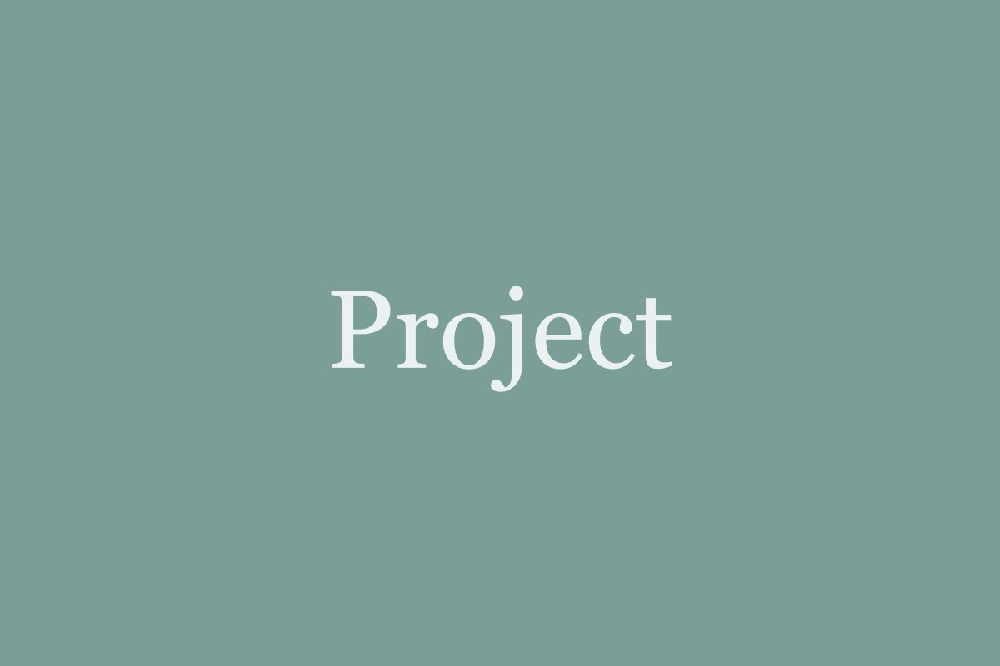

## Motivation

Placeholder text. Describe the problem the project addresses and why it matters. Two or three paragraphs are usually enough; the page also lists the team, related publications and news automatically.

## Approach

Explain the method, data and studies. You can include images by placing them in `src/assets/projects/` and referencing them with a relative path:

```md

```

## Outcomes

Summarise the results so far. Publications with `project = {dialogue-grounding}` in the BibTeX file appear below this text.
